# Hand Tracking Shape Drawing

A real-time hand tracking application that lets you draw shapes in the air using your webcam. Built with **MediaPipe** and **OpenCV**.

## How It Works

The app detects your hands through the webcam and tracks **21 landmarks** per hand. You use specific finger tips to control shapes drawn on screen.

### Hand Landmarks

Each hand has 21 tracked points (0-20), organized by finger:

<p align="center">
  
</p>

| Finger | Landmarks | Color |
|--------|-----------|-------|
| **Thumb** | 1 (CMC), 2 (MCP), 3 (IP), **4 (Tip)** | Green |
| **Index** | 5 (MCP), 6 (PIP), 7 (DIP), **8 (Tip)** | Blue |
| **Middle** | 9 (MCP), 10 (PIP), 11 (DIP), **12 (Tip)** | Brown |
| **Ring** | 13 (MCP), 14 (PIP), 15 (DIP), 16 (Tip) | Pink |
| **Pinky** | 17 (MCP), 18 (PIP), 19 (DIP), 20 (Tip) | Orange |
| **Wrist** | 0 | Purple |

The **bold tip landmarks** (4, 8, 12) are the ones used by this app to draw shapes.

### Detecting Open vs Closed Fingers

To know if a finger is **open** (extended) or **closed** (curled), we compare the **y position** of the **tip** to the **MCP (base knuckle)**:

<p align="center">
  
</p>

> **Important:** In image coordinates, `y = 0` is at the **top** of the screen. So a smaller y value means higher on screen.

**The rule is simple:**

| State | Condition | Explanation |
|-------|-----------|-------------|
| **Open** | `tip.y < mcp.y` | The finger tip is **above** the base knuckle — the finger is extended |
| **Closed** | `tip.y > mcp.y` | The finger tip is **below** (or at) the base knuckle — the finger is curled |

**Example with the index finger:**

```python
# Landmark indices
INDEX_MCP = 5   # base knuckle
INDEX_TIP = 8   # fingertip

# Check if index finger is open
tip_y = hand_landmarks[INDEX_TIP].y
mcp_y = hand_landmarks[INDEX_MCP].y

is_open = tip_y < mcp_y   # tip is above base → finger is extended
is_closed = tip_y > mcp_y  # tip is below base → finger is curled
```

**For all fingers:**

| Finger | MCP (base) | TIP | Open when |
|--------|------------|-----|-----------|
| Index | 5 | 8 | `landmarks[8].y < landmarks[5].y` |
| Middle | 9 | 12 | `landmarks[12].y < landmarks[9].y` |
| Ring | 13 | 16 | `landmarks[16].y < landmarks[13].y` |
| Pinky | 17 | 20 | `landmarks[20].y < landmarks[17].y` |

**Thumb is different** — since it moves sideways, compare the **x position** instead:

```python
# For the right hand: thumb is open when tip is to the left of the MCP
is_thumb_open = hand_landmarks[4].x < hand_landmarks[2].x
```

## Features

### Shape Drawing (both hands required)

Use **thumb tip (4)**, **index finger tip (8)**, and **middle finger tip (12)** from each hand to draw shapes:

| Shape | How it uses your fingers |
|-------|--------------------------|
| **Circle** | Center = midpoint of all finger tips. Radius = half the max spread between them. |
| **Rectangle** | Thumb + index tips from each hand form the 4 corners of a quadrilateral. |
| **3D Cube** | Hand 1 (3 finger tips) = front face. Hand 2 (3 finger tips) = back face. Edges connect them. |

### Color Palette (top center)

4 color buttons at the top of the screen:
- **Green** (default)
- **Red**
- **Blue**
- **Yellow**

### Shape Palette (left side)

3 shape buttons on the left side with preview icons:
- **Circle**
- **Rectangle** (default)
- **Cube** (3D)

### Selection

Use your **right hand index finger (landmark 8)** to hover over any color or shape button to select it.

## Requirements

- Python 3.10+
- Webcam

### Dependencies

```
opencv-python
mediapipe
```

## Installation

```bash
pip install -r requirements.txt
```

The hand landmarker model (`hand_landmarker.task`) will need to be present in the project directory. Download it with:

```bash
curl -O https://storage.googleapis.com/mediapipe-models/hand_landmarker/hand_landmarker/float16/latest/hand_landmarker.task
```

## Usage

```bash
python main.py
```

- Show **both hands** to the camera to draw shapes
- Point your **right index finger** at the top buttons to change color
- Point your **right index finger** at the left buttons to change shape
- Press **q** to quit

## Controls

| Action | How |
|--------|-----|
| Select color | Right hand index finger over top palette |
| Select shape | Right hand index finger over left palette |
| Draw shape | Show both hands, spread thumb + index + middle fingers |
| Quit | Press `q` |
